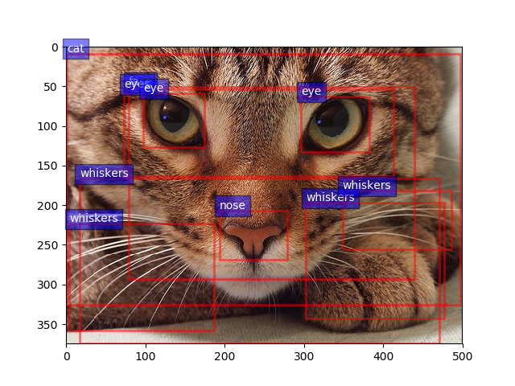
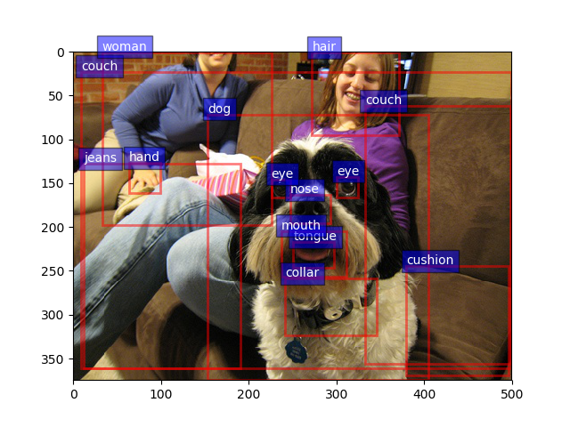

# Faster R-CNN with model pretrained on Visual Genome
Faster RCNN model in Pytorch version, pretrained on the Visual Genome with ResNet 101

## Introduction

we provide

* **[Pretrained Faster RCNN model](https://drive.google.com/file/d/18n_3V1rywgeADZ3oONO0DsuuS9eMW6sN/view?usp=sharing)**, which is trained with Visual Genome + Res101 + Pytorch

* **Pytorch implementation of processing data tools**, ```generate_tsv.py``` and ```convert_data.py```, the Caffe version of which is provided by the ['bottom-up-attention'](https://github.com/peteanderson80/bottom-up-attention)

## Model

we use the same setting and benchmark as [faster-rcnn.pytorch](https://github.com/jwyang/faster-rcnn.pytorch/tree/pytorch-1.0). The results of the model are shown below.

model    |dataset| #GPUs | batch size | lr        | lr_decay | max_epoch     | mAP
---------|---------|--------|-----|--------|-----|-----|-----
[Res-101](https://drive.google.com/file/d/18n_3V1rywgeADZ3oONO0DsuuS9eMW6sN/view?usp=sharing)    |  Visual Genome | 1 1080TI | 4    |1e-3| 5   | 20  |   10.19

Download the pretrained model and put it to the folder $load_dir.


## Utilization

### Prerequisites

* Python 3.6 or higher
* Pytorch 1.0

### Preparation

Clone the code
```
git clone https://github.com/shilrley6/Faster-R-CNN-with-model-pretrained-on-Visual-Genome.git
```

#### Pretrained image model

Download the pretrained VGG16 and ResNet101 models according to your requirement, which are provided by [faster-rcnn.pytorch](https://github.com/jwyang/faster-rcnn.pytorch/tree/pytorch-1.0).

* VGG16: [Dropbox](https://www.dropbox.com/s/s3brpk0bdq60nyb/vgg16_caffe.pth?dl=0), [VT Server](https://filebox.ece.vt.edu/~jw2yang/faster-rcnn/pretrained-base-models/vgg16_caffe.pth)

* ResNet101: [Dropbox](https://www.dropbox.com/s/iev3tkbz5wyyuz9/resnet101_caffe.pth?dl=0), [VT Server](https://filebox.ece.vt.edu/~jw2yang/faster-rcnn/pretrained-base-models/resnet101_caffe.pth)

Then put them into the path 'data/pretrained_model/'.


#### Compilation

Install all the python dependencies using pip:
```
pip install -r requirements.txt
```

Compile the cuda dependencies using following simple commands:

```
cd lib
python setup.py build develop
```

#### Pycocotools (Optional)

If you didn't install COCO API before, you are supposed to follow the following steps.

```
cd data
git clone https://github.com/pdollar/coco.git
cd coco/PythonAPI
make
```

### Data processing

#### Generate tsv

Run ```generate_tsv.py``` to extract features of image regions. The output file format will be a tsv, where the columns are ['image_id', 'image_w', 'image_h', 'num_boxes', 'boxes', 'features'].

```
python generate_tsv.py --net res101 --dataset vg  \
                       --out $out_file --cuda
```

Change the parameter $load_dir (the path to the model, default is 'models') to adapt your environment.

PS. If you download other pretrained models, you can rename the model as 'faster_rcnn_$net_$dataset.pth' and modify the parameter $net and $dataset.

#### Convert data

Run ```convert_data.py``` to convert the above output to a numpy array. The output file format will be a npy, including image region features.

```
python convert_data.py --imgid_list $imgid_list  \
                       --input_file $input_file --output_file $output_file
```

The ' $imgid_list is a list of image ids, the format of which is 'txt'.

#### Demo

You can use this function to show object detections on demo images with a pre-trained model by running:

```
python demo.py --net res101 --dataset vg \
               --load_dir $load_dir --cuda
```

You can also add images to the folder 'images' and change the parameter $image_file.

Below are some detection results:

<div style = 'color:#0000FF' align = 'center'>
 
</div>

PS. If you download other pretrained models, you can rename the model as 'faster_rcnn_$net_$dataset.pth' and modify the parameter $net and $dataset.

## Acknowledgments
Thanks to ['bottom-up-attention'](https://github.com/peteanderson80/bottom-up-attention) and [faster-rcnn.pytorch](https://github.com/jwyang/faster-rcnn.pytorch/tree/pytorch-1.0).
